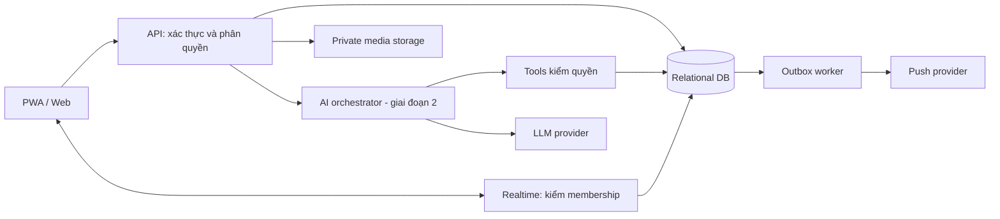

# Kiến trúc hệ thống

**Baseline:** web/PWA và backend dạng một ứng dụng có module rõ, một relational database, private object storage, worker cho lịch/notification, realtime transport. Stack monorepo đã chọn theo [ADR-001](decisions/ADR-001-monorepo.md): Next.js, Fastify và PostgreSQL trên npm workspaces/Turbo. Web/API/worker mới là nền tảng; storage, realtime, notification handler và provider chưa triển khai. Không tạo microservices hoặc vector DB chỉ để dự phòng.

## Trách nhiệm

- Client trình bày, upload có kiểm soát và hiển thị trạng thái. Không giữ service credential, không tự quyết định quyền từ UI.
- API auth adapter xác thực User; membership resolver xác nhận nhà; policy kiểm hành động và trường; domain service thực hiện transaction.
- Realtime phát sự kiện sau commit; client tải lại nguồn chuẩn khi cần. Có reconnect, cursor và dedupe. Không dùng tên room khó đoán làm bảo mật.
- Worker đọc outbox đã ghi cùng transaction; kiểm quyền lại ngay trước push; retry giới hạn; giữ lỗi để vận hành xử lý.
- Storage private; API cấp quyền truy cập media theo parent content. Public URL vĩnh viễn không phù hợp.
- AI chỉ gọi tool allowlist; structured query trước, document retrieval sau nếu có nhu cầu.

## Offline và cache

PWA có thể cache app shell. Baseline không cache offline contact riêng, response AI hoặc chat bằng service worker. API riêng tư dùng cache policy phù hợp, xóa cache người dùng khi logout/đổi nhà; server cache phải có family, actor và permission revision. Offline cho dữ liệu nhạy cảm cần quyết định riêng.

## Triển khai và truy cập

HTTPS domain → link/QR mời → mở trình duyệt → đăng nhập → duyệt → thêm màn hình chính nếu muốn. Cài PWA không tự cấp quyền notification. Trên iOS, cần Home Screen web app trên phiên bản hỗ trợ và người dùng cho phép push; hướng dẫn theo thiết bị, kiểm lại tại thời điểm triển khai. [WebKit](https://webkit.org/blog/13878/web-push-for-web-apps-on-ios-and-ipados/), [PWA installation](https://web.dev/learn/pwa/installation?hl=en).

Native dùng lại backend/API nhưng có UI và widget riêng; không hứa tái sử dụng toàn bộ mã giao diện. TestFlight là kênh beta có hạn 90 ngày mỗi build, không chọn làm phân phối nội bộ lâu dài. [Apple](https://developer.apple.com/help/app-store-connect/test-a-beta-version/testflight-overview).

## Quyết định vận hành còn mở

Stack development được chọn để chia sẻ TypeScript/contracts và dùng được trên Windows/CI. Hosting, auth, job delivery, media và AI provider vẫn cần so sánh khả năng export/backup, quyền tenant/field, chi phí ảnh/egress, xác thực và vận hành. Managed PostgreSQL là lựa chọn triển khai cần xác minh giá/giới hạn lúc chọn. Ghi lý do và rủi ro trong decision, không coi local Docker là thiết kế production hoàn chỉnh.

## Vận hành tối thiểu

Dev/staging dùng dữ liệu giả, production riêng secrets và database. Health check, lỗi ẩn PII, thống kê tổng hợp, quota upload/AI và cảnh báo chi phí. Đề xuất backup hằng ngày, RPO 24 giờ và RTO 1 ngày cho pilot; chỉ công bố khi đã diễn tập và xác nhận provider đáp ứng. Có người phụ trách xử lý lỗi job, thu hồi quyền và phục hồi dữ liệu.
