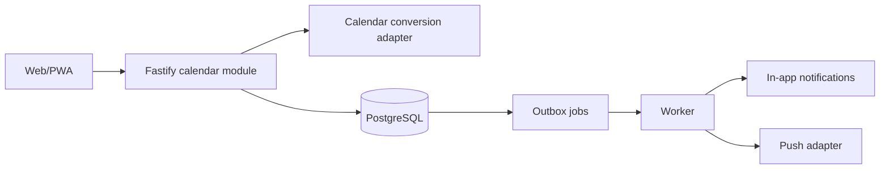

# Thiết kế nền tảng Ngày quan trọng và lời nhắc

**Ngày:** 2026-09-13

**Trạng thái:** Đã chốt để lập kế hoạch triển khai

**Requirement:** FR-04, mở rộng FR-07
**Context:** 1.4.0

## 1. Mục tiêu

Tạo một luồng dùng được từ đầu đến cuối để gia đình 15 người ghi nhớ sinh nhật, ngày giỗ, ngày cưới và cuộc gặp. Thành viên phải biết việc gì sắp tới ngay từ **Nhà mình**, mở được chi tiết, phản hồi tham dự và nhận lời nhắc trong app. Lời nhắc push chỉ được bật sau khi outbox, quyền và chống trùng đã được chứng minh.

Đây là vertical slice giữ chân đầu tiên sau cây gia phả. Nó dùng dữ liệu Member đã có nhưng không tự biến mọi ngày sinh thành Event, không đoán phong tục và không dùng LLM để đổi ngày âm.

## 2. Phạm vi bàn giao

### Có trong gói

- Danh sách ngày sắp tới theo dòng thời gian, ưu tiên điện thoại.
- Sự kiện một lần hoặc lặp hằng năm theo dương lịch hay âm lịch Việt Nam.
- Loại sự kiện: sinh nhật, ngày giỗ, kỷ niệm cưới, họp mặt và khác.
- Sự kiện cả ngày hoặc có giờ; timezone IANA, mặc định theo FamilySpace.
- Gắn một Member cho sinh nhật/ngày giỗ khi người tạo chọn.
- Tạo, xem, sửa và hủy bởi người tạo hoặc admin.
- RSVP `yes`, `no`, `maybe` cho từng lần diễn ra.
- Lời nhắc trước 7 ngày, 1 ngày và trong ngày, cho phép tắt từng mốc.
- Inbox thông báo trong app là nguồn ghi nhận chính.
- Outbox worker có lease, retry, revision check và dedupe.
- Web Push sau khi inbox/outbox đạt và đã thử app đóng trên thiết bị hỗ trợ.

### Chưa làm trong gói

- Đồng bộ Google/Apple Calendar, SMS hoặc email reminder.
- Sự kiện theo circle/nhánh/hộ; pilot chỉ phạm vi cả nhà.
- Nhiều người tổ chức, danh sách khách ngoài gia đình, bản đồ hoặc theo dõi vị trí.
- Quy tắc lặp tùy ý kiểu RRULE, chuỗi sự kiện phức tạp hoặc chỉnh riêng một occurrence.
- AI tạo, đổi hoặc diễn giải ngày âm.

## 3. Trải nghiệm sản phẩm

### Nhà mình

Khối **Ngày gần nhất** nằm sau lời chào và trước nội dung ít khẩn cấp. Nó hiển thị ảnh/monogram người liên quan nếu có, tên ngày, nhãn âm/dương, số ngày còn lại và hành động phù hợp. Bên dưới là tối đa ba ngày kế tiếp cùng lối **Xem tất cả**.

Khi chưa có dữ liệu, nội dung giải thích ngắn: “Nhà mình chưa ghi ngày nào” và một hành động **Thêm ngày quan trọng**. Không đặt số liệu giả hoặc thẻ thống kê.

### Màn Ngày quan trọng

Màn được mở từ Nhà mình, không thêm tab thứ sáu. Bố cục chính là dòng thời gian theo tháng, vì nhu cầu đầu tiên là biết việc sắp tới chứ không phải quản trị một lưới lịch dày. Chế độ tháng có thể bổ sung sau khi timeline được thử với gia đình thật.

Mỗi hàng dùng nhịp thị giác album gia đình:

- ngày lớn ở mép trái;
- tên người hoặc ảnh nhỏ làm điểm nhận diện;
- tiêu đề và cách ngày ở giữa;
- nhãn “Âm lịch”, “Cả ngày” hoặc giờ ở dòng phụ;
- trạng thái RSVP của chính người xem, không công khai số liệu kiểu mạng xã hội.

Chạm hàng mở chi tiết dạng sheet trên mobile và vùng bổ trợ trên desktop. URL giữ event/occurrence đang mở để back, reload và deep link hoạt động.

### Tạo hoặc sửa

Form chia ba bước ngắn:

1. **Ngày gì?** Chọn loại, tiêu đề và người liên quan nếu có.
2. **Khi nào?** Chọn dương/âm, ngày gốc, một lần/hằng năm, cả ngày/giờ và chính sách ngày đặc biệt.
3. **Nhắc cả nhà thế nào?** Chọn các mốc nhắc, xem trước lần diễn ra gần nhất rồi xác nhận.

UI luôn hiển thị ngày gốc và lần dương lịch sắp tới cạnh nhau với nhãn rõ. Nếu converter chưa xác nhận được ngày, nút lưu bị chặn với lỗi có thể hiểu được; không tự thay ngày.

### Inbox lời nhắc

Biểu tượng chuông trong app bar mở inbox, không tạo thêm bottom-tab. Mỗi thông báo có nội dung chung, thời điểm và deep link. Chưa đọc chỉ dùng dấu hiệu nhẹ; không dùng badge gây áp lực hoặc cơ chế streak.

Push là kênh bổ sung. Tắt push, thiết bị không hỗ trợ hoặc token hỏng không làm mất Event hay inbox.

## 4. Quy tắc nghiệp vụ

### Quyền

- Active member trong FamilySpace có thể tạo Event phạm vi cả nhà.
- Creator hoặc active admin có thể sửa/hủy Event.
- Active member chỉ ghi RSVP cho membership của chính mình.
- Guest, pending và revoked không đọc Event, Occurrence, RSVP, Notification hoặc subscription của nhà.
- Worker dùng credential đặc quyền vẫn phải resolve `family_id`, active membership, preference và event revision trước khi tạo/gửi từng notification.
- Deep link luôn tải lại qua API; biết ID không cấp quyền.

### Loại ngày và lặp

- `calendar_type`: `gregorian` hoặc `lunar_vietnamese`.
- `recurrence`: `none` hoặc `yearly`.
- Event một lần bắt buộc có năm gốc.
- Event lặp hằng năm giữ ngày/tháng gốc; năm nguồn là dữ liệu tham khảo, không dùng làm năm occurrence tiếp theo.
- Sinh nhật chỉ có `birth_year` nhưng thiếu ngày/tháng không thể tạo reminder tự động.
- Gắn Member là tùy chọn ở contract tổng quát; UI yêu cầu Member cho sinh nhật và khuyến nghị cho ngày giỗ.

### Ngày không tồn tại

- Dương lịch 29/2 lặp dùng `feb29_policy`: `feb28`, `mar1` hoặc `skip`; UI đề xuất `feb28` nhưng người tạo xác nhận.
- Âm lịch ngày 30 trong tháng chỉ có 29 ngày dùng `missing_day`: `last_day` hoặc `skip`; UI đề xuất `last_day` nhưng hiển thị trước khi lưu.
- `month_mode`: `regular`, `leap_only`, `both`. Ngày giỗ đề xuất `regular`; ngày nguồn thuộc tháng nhuận bắt buộc người tạo xác nhận.
- Converter trả version thuật toán và range hỗ trợ. Ngoài range hoặc lỗi xác minh trả `CALENDAR_UNAVAILABLE` và không tạo occurrence.

### Lần diễn ra

- Occurrence là bản ghi cụ thể được tạo từ Event revision hiện hành.
- API duy trì cửa sổ rolling từ 30 ngày trước đến 18 tháng sau; worker bổ sung cửa sổ định kỳ.
- Unique theo Event, local date/time và revision để phép `both` vẫn tạo được hai lần khác nhau trong một năm.
- Sửa trường ảnh hưởng lịch tăng revision, hủy occurrence/jobs tương lai của revision cũ và tạo lại trong cùng transaction/outbox boundary.
- Hủy Event không xóa lịch sử RSVP/audit; occurrence tương lai chuyển `cancelled`.

### Lời nhắc

- Các offset: `seven_days`, `one_day`, `same_day`.
- Event cả ngày: due lúc 09:00 theo timezone Event.
- Event có giờ: 7 ngày và 1 ngày vào 09:00 ngày tương ứng; cùng ngày lúc 09:00. Nếu sự kiện bắt đầu trước hoặc bằng mốc đó, dời đến 07:00 nếu còn trước sự kiện, nếu không thì bỏ.
- Quiet hours mặc định 21:00–07:00. Job trong quiet hours dời đến 07:00 nếu vẫn hữu ích.
- Job trễ quá 2 giờ hoặc đã qua lúc bắt đầu thì bỏ push; Event vẫn xuất hiện trong app.
- Dedupe inbox: family + recipient membership + occurrence + event revision + offset + kind.
- Retry lỗi tạm thời tối đa 5 lần với backoff trong cửa sổ hữu ích. Token không hợp lệ bị vô hiệu hóa.

## 5. Mô hình dữ liệu

### `events`

Các cột chính:

- `id`, `family_id`, `creator_membership_id`, `member_id?`
- `kind`, `title`, `note?`, `location?`
- `calendar_type`, `recurrence`, `timezone`
- `date_parts` đã validate theo loại, `starts_local_time?`, `duration_minutes?`
- `lunar_month_mode?`, `missing_day_policy?`, `feb29_policy?`
- `reminder_offsets`, `revision`, `status`, `created_at`, `updated_at`

Không lưu JSON tùy ý: CHECK constraint và contract phải ràng buộc cặp calendar/recurrence/date parts. Composite FK bảo đảm Member và creator membership cùng `family_id`.

### `event_occurrences`

- `id`, `family_id`, `event_id`, `event_revision`
- `local_date`, `starts_at?`, `ends_at?`, `calendar_conversion_version?`
- `status`, `created_at`

### `event_rsvps`

- `family_id`, `occurrence_id`, `membership_id`, `response`, `updated_at`
- Unique `(family_id, occurrence_id, membership_id)`.

### `notification_preferences`

- `family_id`, `membership_id`, `enabled_offsets`, `quiet_start`, `quiet_end`, `push_enabled`, `version`.

### `notifications` và `outbox_jobs`

Notification chứa nội dung inbox tối thiểu, source kind/id, dedupe key, read time. Outbox chỉ chứa tham chiếu và metadata delivery, không copy title riêng tư, contact hoặc body chat vào payload.

Tất cả bảng tenant có `family_id NOT NULL`, composite FK, RLS và index theo access pattern. Migration không dựa vào client cung cấp family scope đáng tin.

## 6. Contract API

### Đọc

- `GET /api/v1/families/{familyId}/events?from&to&cursor&limit`
- `GET /api/v1/families/{familyId}/events/{eventId}`
- `GET /api/v1/families/{familyId}/notifications?cursor&limit&unread`
- `GET /api/v1/families/{familyId}/notification-preferences`

Danh sách trả occurrence trong range, Event summary và RSVP của actor. Không trả toàn bộ RSVP nếu UI không cần; chi tiết có danh sách người tham dự đã lọc theo active membership.

### Ghi

- `POST /events`
- `PATCH /events/{eventId}` với `version`
- `POST /events/{eventId}/cancel` với `version`
- `PUT /occurrences/{occurrenceId}/rsvp`
- `POST /notifications/{notificationId}/read`
- `PATCH /notification-preferences` với `version`
- Đăng ký/hủy push subscription chỉ thêm ở giai đoạn push.

Server lấy actor từ session. Không nhận `creator_membership_id`, RSVP membership hoặc `family_id` từ body như nguồn quyền.

## 7. Kiến trúc triển khai

Calendar conversion là adapter thuần, deterministic và test bằng dataset tham chiếu độc lập. Chọn package/service sau spike tài liệu chính thức, license, timezone, range và tháng nhuận. Nếu dùng package trong process, version converter được ghi trên occurrence. Nếu dùng dịch vụ ngoài, API vẫn bao adapter và timeout/failure không được chuyển thành ngày đoán.

Worker lấy job bằng lease/`FOR UPDATE SKIP LOCKED`, ghi attempt và chỉ hoàn tất sau side effect cho phép. Event transaction ghi outbox cùng commit. API không gửi push trực tiếp.

## 8. Trạng thái lỗi và offline

- Timeline giữ dữ liệu cuối đã tải khi refresh lỗi và hiển thị trạng thái mất mạng cục bộ.
- Form giữ draft trong memory của phiên; không lưu tiêu đề/ghi chú gia đình vào localStorage mặc định.
- Submit có idempotency key để retry không tạo Event trùng.
- Conflict version hiển thị dữ liệu mới và cho người dùng xem lại thay đổi.
- Converter lỗi, ngoài range, ngày sai hoặc policy thiếu có lỗi theo trường.
- Membership revoked xóa scope, đóng sheet và không tiếp tục hiển thị timeline cache.

## 9. Nghiệm thu

- **CAL-01–10** trong [spec Lịch nhà](../../../specs/calendar/README.md) đều có test tương ứng.
- Timeline và chi tiết hoạt động ở 320/390/768/1280 px, zoom chữ 200%, tên dài và thiếu ảnh.
- Một Event được tạo, reload vẫn còn; occurrence đúng range; actor RSVP lại chỉ còn một bản ghi.
- Sửa/hủy làm job revision cũ vô hiệu; retry worker không tạo notification inbox trùng.
- Hai FamilySpace không đọc/chỉnh/nhận lời nhắc của nhau.
- Revoked membership giữa enqueue và delivery không nhận notification mới.
- Ngày âm, tháng nhuận và giao năm dùng expected dates từ nguồn độc lập; output của converter không tự làm expected.
- Push chỉ được đánh dấu hoàn thành sau thử app đóng trên thiết bị hỗ trợ. Inbox vẫn hoạt động khi push bị tắt.

## 10. Chia lát phát hành

1. **Calendar core:** contract, converter spike/dataset, schema, occurrence, CRUD/RSVP API.
2. **Mobile experience:** Nhà mình + timeline + detail + wizard tạo/sửa.
3. **Reliable reminders:** preferences, notifications, outbox worker, inbox.
4. **Push pilot:** subscription, provider adapter, service worker/PWA và thử thiết bị thật.

Mỗi lát là một PR review được. Không mở Chat/Moments trong lúc contract calendar hoặc delivery còn chưa ổn định.
